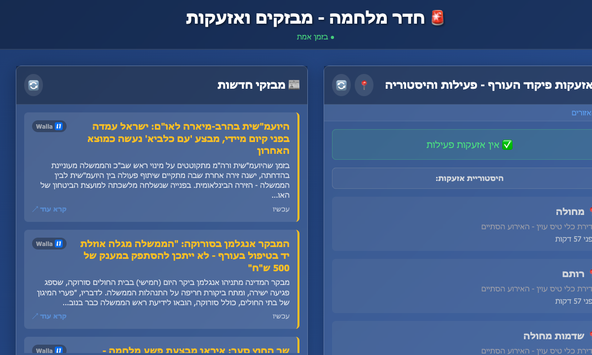

# War Room - News & Alerts Aggregator

A real-time web application that aggregates Ynet breaking news and Israeli Homefront Command alerts in a clean, two-column layout with instant WebSocket updates.



## Features

- **Real-time Updates**: WebSocket connections with instant push updates (2-second server polling)
- **Dual Data Sources**:
  - Ynet breaking news RSS feed
  - Israeli Homefront Command alerts
- **Modern UI**: Responsive design with Hebrew RTL support
- **Caching**: Server-side caching to reduce API calls
- **Error Handling**: Graceful fallbacks and error messages
- **Accessibility**: Keyboard shortcuts and screen reader friendly

## Quick Start

1. **Install dependencies**:
   ```bash
   npm install
   ```

2. **Start the server**:
   ```bash
   npm start
   ```

3. **Open in browser**:
   ```
   http://localhost:3000
   ```

## Development

Run with auto-reload:
```bash
npm run dev
```

## API Endpoints

- `GET /api/ynet` - Fetch latest Ynet breaking news
- `GET /api/alerts` - Fetch current Homefront Command alerts
- `GET /api/health` - Health check endpoint

## Architecture

```
├── server.js          # Express + WebSocket server with real-time data polling
├── public/
│   ├── index.html     # Main HTML page
│   ├── style.css      # Styles with RTL support
│   └── script.js      # Frontend with WebSocket client + fallback polling
└── package.json       # Dependencies and scripts
```

## Real-time Architecture

- **Backend**: Polls OREF/Ynet APIs every 2 seconds, broadcasts changes via WebSocket
- **Frontend**: Receives instant WebSocket updates with automatic fallback to 3-second polling
- **Connection Status**: Visual indicator shows real-time/polling/offline status
- **Resilience**: Automatic reconnection with exponential backoff

## Data Sources

- **Ynet RSS**: `https://www.ynet.co.il/Integration/StoryRss1854.xml`
- **Homefront Alerts**: `https://www.oref.org.il/warningMessages/alert/Alerts.json`
- **Alert Areas**: `https://alerts-history.oref.org.il/Shared/Ajax/GetDistricts.aspx?lang=he`
- **Fallback Alerts**: `https://api.tzevaadom.co.il/notifications`

All data comes directly from official Israeli government sources.

## Features

- ✅ Real-time data fetching
- ✅ Responsive design
- ✅ Hebrew RTL support
- ✅ Error handling
- ✅ Real-time WebSocket updates with 3-second fallback polling
- ✅ Visual alerts for recent threats
- ✅ Auto-refresh on tab focus
- ✅ Keyboard shortcuts (Ctrl+R to refresh)

## Browser Support

Modern browsers with ES6+ support.
