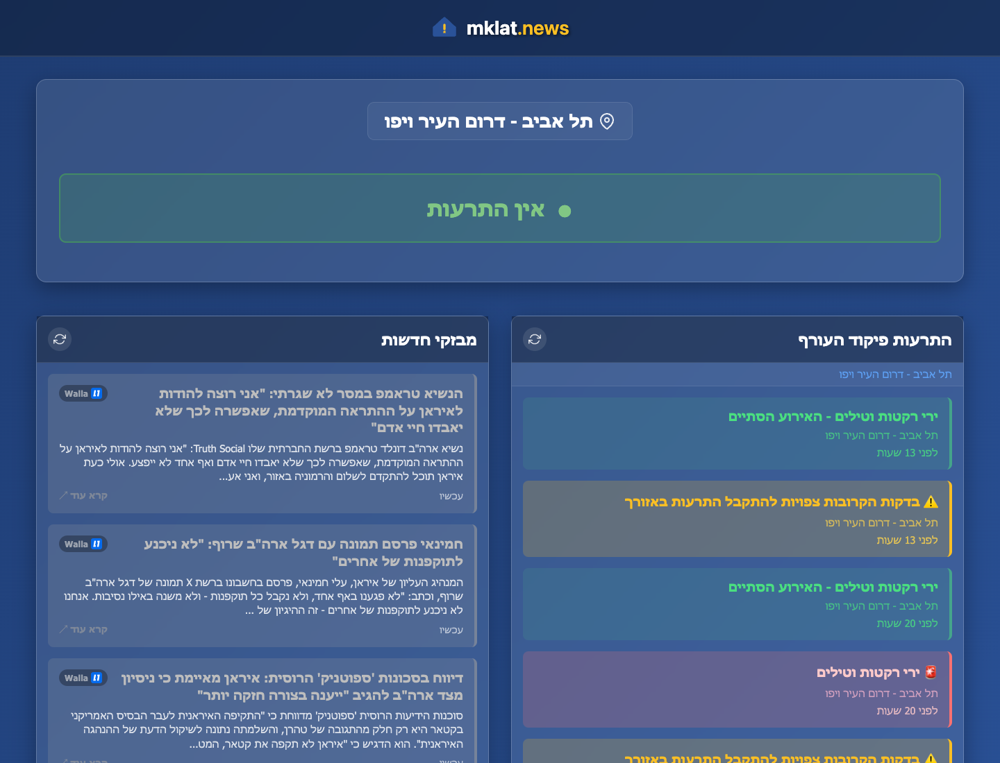

# mklat.news - חדשות והתרעות בזמן אמת

> **🚧 MOBILE APP REWRITE IN PROGRESS**  
> The web app is being replaced by a Flutter mobile app. The web app code remains in this repo for reference but is no longer maintained.  
> See [`.agent/`](.agent/) for product specs and implementation plan.

> **⚠️ IMPORTANT DISCLAIMER**  
> **This project is for educational and development purposes only. Do NOT use this as your primary source for emergency alerts. Always rely on official government channels and approved alert applications for life-safety information.**

A "situation room" companion app for Israeli emergency alerts - the app you open *after* being alerted to check status, track the event lifecycle, and get news context.



## Features

- **Real-time Updates**: WebSocket connections with instant push updates (2-second server polling)
- **Alert History**: Comprehensive timeline showing both active alerts (🚨) and historical events (📍)
- **Location Filtering**: Dynamic location selector with search and bulk operations
- **Dual Data Sources**:
  - Ynet breaking news RSS feed
  - Israeli Homefront Command current alerts
  - OREF historical alerts with event timeline
- **Modern UI**: Responsive design with Hebrew RTL support and status indicators
- **Smart UX**: Clear active alert status, intuitive location picker with OK button
- **Caching**: Server-side caching to reduce API calls
- **Error Handling**: Graceful fallbacks and error messages

## Quick Start

1. **Install dependencies**:
   ```bash
   npm install
   ```

2. **Start the server**:
   ```bash
   npm start
   ```

3. **Open in browser**:
   ```
   http://localhost:3000
   ```

## Development

Run with auto-reload:
```bash
npm run dev
```

## API Endpoints

- `GET /api/ynet` - Fetch latest Ynet breaking news
- `GET /api/alerts` - Fetch current and historical alerts (combined timeline)
- `GET /api/alert-areas` - Fetch available alert locations
- `GET /api/health` - Health check endpoint

## Architecture

```
├── server.js          # Express + WebSocket server with real-time data polling
├── public/
│   ├── index.html     # Main HTML page
│   ├── style.css      # Styles with RTL support
│   └── script.js      # Frontend with WebSocket client + fallback polling
└── package.json       # Dependencies and scripts
```

## Real-time Architecture

- **Backend**: Polls OREF/Ynet APIs every 2 seconds, broadcasts changes via WebSocket
- **Frontend**: Receives instant WebSocket updates with automatic fallback to 3-second polling
- **Connection Status**: Visual indicator shows real-time/polling/offline status
- **Resilience**: Automatic reconnection with exponential backoff

## Data Sources

- **Ynet RSS**: `https://www.ynet.co.il/Integration/StoryRss1854.xml`
- **Current Alerts**: `https://www.oref.org.il/warningMessages/alert/Alerts.json`
- **Historical Alerts**: `https://alerts-history.oref.org.il/Shared/Ajax/GetAlerts.aspx?lang=he`
- **Alert Areas**: `https://alerts-history.oref.org.il/Shared/Ajax/GetDistricts.aspx?lang=he`
- **Fallback Alerts**: `https://api.tzevaadom.co.il/notifications`

All data comes directly from official Israeli government sources with real-time updates.

## Implementation Status

- ✅ Real-time WebSocket updates with fallback polling
- ✅ Historical alert timeline with OREF integration
- ✅ Location-based alert filtering with intuitive UI
- ✅ Active alert status indicators
- ✅ Responsive design with Hebrew RTL support
- ✅ Comprehensive test coverage (90% success rate)
- ✅ CI/CD pipeline with automated testing
- ✅ Error handling and graceful degradation

## Contributing

We welcome contributions! Please see [CONTRIBUTING.md](CONTRIBUTING.md) for guidelines.

- 🐛 **Bug Reports**: Use our [issue templates](.github/ISSUE_TEMPLATE/)
- ✨ **Feature Requests**: Check [existing issues](https://github.com/barlevalon/mklat.news/issues) first
- 🤝 **Pull Requests**: Follow our [PR template](.github/pull_request_template.md)
- 🆘 **Good First Issues**: Look for [`good first issue`](https://github.com/barlevalon/mklat.news/labels/good%20first%20issue) label

## License

MIT License - see [LICENSE](LICENSE) file for details.

## Browser Support

Modern browsers with ES6+ support.
