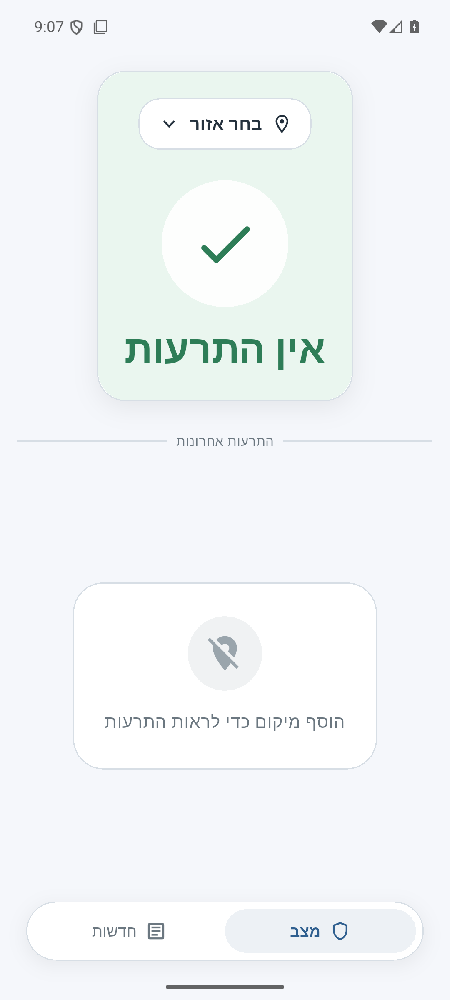
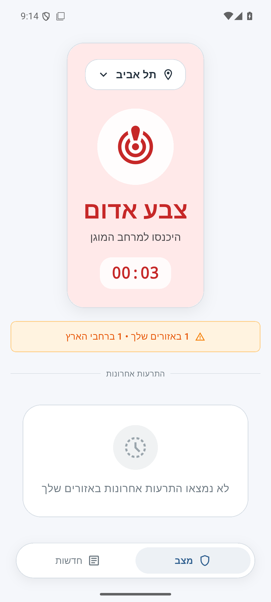
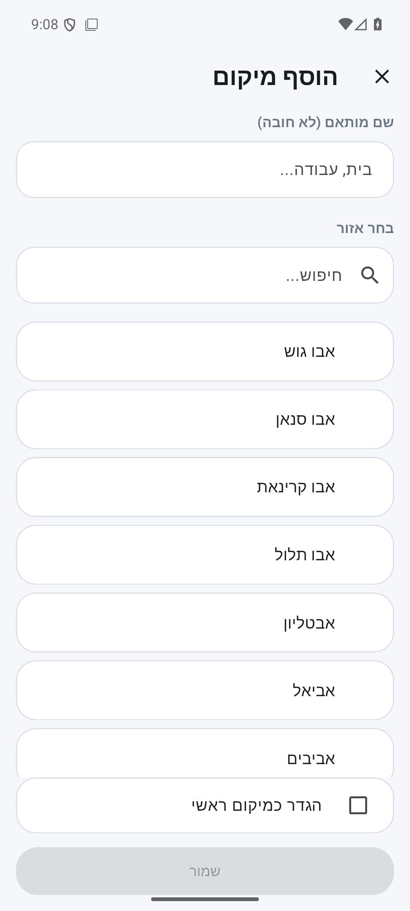
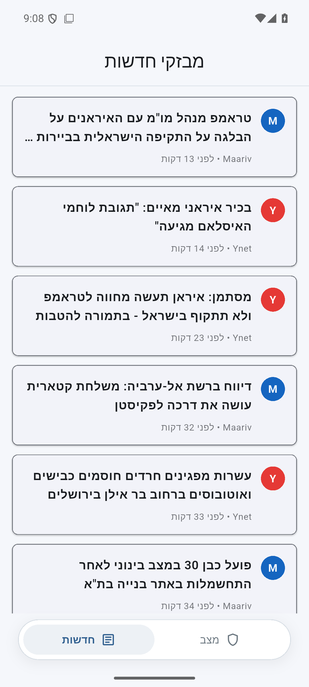

# mklat.news

> **Safety notice**
>
> mklat.news is not an official emergency-alert app. Do not rely on it as your primary life-safety source. Use official Home Front Command channels and approved emergency applications.

mklat.news is a Hebrew-first Android app for checking emergency-alert status and nearby news context after you have already received an official alert.

## Download the app

Download the latest APK from GitHub Releases:

[Download mklat.news releases](https://github.com/barlevalon/mklat.news/releases)

Choose the newest release and download the Android APK, named like:

```text
mklat-news-<version>-android-v<release>.apk
```

## Install on Android

1. Download the APK on your Android device.
2. Open the downloaded file.
3. If Android asks, allow installing apps from your browser or file manager.
4. Confirm installation.
5. Open **mklat.news**.

## Updating

Download the APK from the newest release and install it over the existing app.

If Android refuses to update because the signature does not match, uninstall the old app once and install the newest APK. This can happen when moving from an older pre-1.1.2 build to the stable signed GitHub release builds.

## What mklat.news shows

- Current alert status for your primary saved location.
- Active alerts in your secondary saved locations.
- Recent alert history.
- Nationwide active-alert summary.
- Hebrew news updates from Ynet, Maariv, and Haaretz RSS feeds.
- Offline and data-load error states.

## Screenshots

<table>
  <tr>
    <td><strong>Current status</strong></td>
    <td><strong>Active alert</strong></td>
    <td><strong>Add a location</strong></td>
    <td><strong>News updates</strong></td>
  </tr>
  <tr>
    <td></td>
    <td></td>
    <td></td>
    <td></td>
  </tr>
</table>

## Data sources

mklat.news reads public OREF / Home Front Command endpoints and public RSS news feeds.

Main sources:

- OREF current alerts
- OREF alert history
- OREF districts / shelter-time data
- Ynet RSS
- Maariv RSS
- Haaretz RSS

## Privacy

The app stores your saved locations locally on your device. It does not require an account.

## For developers

Developer setup, tests, build commands, and release workflow details are in the repository README:

[Developer README](https://github.com/barlevalon/mklat.news#readme)
